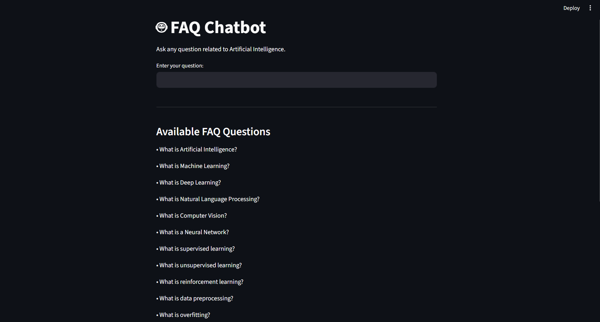

# 🤖 AI FAQ Chatbot

## 📌 Project Overview

The AI FAQ Chatbot is an intelligent question-answering system developed using Python, Streamlit, and Natural Language Processing (NLP) techniques. The chatbot is designed to answer frequently asked questions related to Artificial Intelligence by identifying the most relevant question from a predefined dataset and returning the corresponding answer.

This project demonstrates the practical implementation of NLP concepts such as text vectorization and similarity matching in a user-friendly web application.

---

## 🎯 Objectives

* Develop an interactive FAQ chatbot.
* Implement NLP-based text processing.
* Provide accurate answers to user queries.
* Create a simple and responsive user interface.

---

## 🚀 Features

* Interactive chatbot interface
* AI-related FAQ knowledge base
* Real-time question matching
* TF-IDF based text vectorization
* Cosine Similarity for answer retrieval
* Fast and easy-to-use web application

---

## 🛠️ Technologies Used

* Python
* Streamlit
* Scikit-learn
* TF-IDF Vectorizer
* Cosine Similarity

---

## ⚙️ Working Principle

1. User enters a question in the chatbot.
2. The input question is processed using NLP techniques.
3. TF-IDF converts text into numerical vectors.
4. Cosine Similarity compares the user query with stored FAQ questions.
5. The chatbot returns the most relevant answer.

---

## 📂 Project Structure

AI-FAQ-Chatbot/

├── app.py

├── requirements.txt

├── README.md

---

## ▶️ Installation & Execution

Install dependencies:

pip install -r requirements.txt

Run the application:

streamlit run app.py

---

## 📸 Screenshots

### 🏠 Home Page

### 💬 Chatbot Response

---

## 🔮 Future Enhancements

* Voice-enabled chatbot
* Multi-language support
* Larger FAQ database
* Integration with Generative AI models
* Database connectivity

---

## 👩‍💻 Author

**Anshika Jangid**
